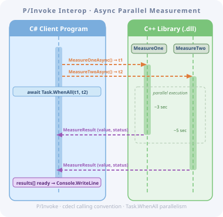

# Interop Communication Example



## Stage 2. "Simulated Device Driver" - Time-Consumptive Methods Execution

In the first experiment with P/Invoke, everything was simple: one function call, one result, no surprises. The real systems are never that simple. They are more complex and more interesting.

What happens when native code blocks the control flow, runs in parallel, and the managed side must coordinate everything?

At this experiment stage we emulate real (imaginary) device driver behavior:

- The C++ library exposes two functions to emulate some "measurement" process with different durations.
- The C# client calls these two functions in different tasks to have them working simultaneously, waits until both of them return those results, and prints the  results to the console.

### Implementation Description

- C++ DLL exporting result data structure description to provide structural responses.
- C++ DLL also exports two functions, which imitate a job and return a structural response with a random "measured" value and completion status code.
- C# console application defines a class that can be mapped to the result data structure provided by the C++ library to handle responses natively.
- C# console application imports the C++ library method declarations to make them executable.
- C# console application connects to the DLL, then creates tasks for calling these functions, executes them to run simultaneously, waits until all of them return control, and prints the result to the console.

### Requirements for the Phase 2

#### Native code should

- Do blocking work
- Simulate different durations
- Slightly randomize durations
- Return:
- - Measurement emulation value
- - Status of execution (success/error)

#### It should not

- Know anything about async
- Know anything about .NET
- Spawn unmanaged threads (yet, for this phase)

#### Managed side responsibilities

Managed code should:

- Start both measurements concurrently
- Coordinate with Task
- Await both (Task.WhenAll)
- Aggregate results
- Print results to the console

### Example Behavior

#### Native C++ side

- Exports MeasureOne() function, which works ~3s and returns a result with status code and random value
- Exports MeasureTwo() function, which works ~5s and returns a result with status code and random value
- The working times of the functions should randomly vary in the range ±0.5 seconds

#### Managed C# side

- Starts both operations asynchronously
- Waits for both (Task.WhenAll)
- Prints the combined result

### Meaning of the example

- Transfer structured response from native environment to managed environment
- Perform simultaneous execution, waiting for the result
- Prove calling convention

### Deliverables

- Native DLL exporting response data description and function signatures
- C# console calling it
- One clean run, debugger attached on both sides

### ABI abstraction level

As the project grows, it becomes necessary to separate the abstraction level, which serves as a liaison between native and managed worlds.

**Note:** The better practice is to think about it from the very beginning. But to feel this pleasure of refactoring, it is better to do it now (and not feel the pain of refactoring later, when everything will be bigger). Just to remember it better.

### Project structure

```text
/Interop
│
├── NativeDeviceLib/          (C++ DLL)
│   ├── include/
│   │   └── NativeDeviceLib.h
│   ├── src/
│   │   └── NativeDeviceLib.cpp
│   └── NativeDeviceLib.vcxproj
│
├── ManagedClient/            (C# console app)
│   ├── LibWrapper/
│   │   └── DeviceApi.cs
│   │   └── MeasureResult.cs
│   │   └── MeasureStatus.cs
│   │   └── NativeMethods.cs
│   ├── Program.cs
│   └── ManagedClient.csproj
│
└── InteropPlayground.sln
```

## Development

### 2.1. Add the description of result types and functions to the C++ library header file

```C++
enum class MeasureStatus : int32_t
{
  Ok = 0,
  Failed = 1
};

struct MeasureResult
{
  double value;
  MeasureStatus status;
};

NDL_API MeasureResult __cdecl MeasureOne();
NDL_API MeasureResult __cdecl MeasureTwo(); 
```

It is important to set the exact type of the enum value at the C++ side, to map it to the compatible type at the C# side.

#### Key points of this implementation

- extern "C" → stable ABI
- Fixed-width types
- No STL in the interface
- Struct is copy-friendly (important for transferring data from an unmanaged environment to a managed)

### 2.2. Implement the abstraction level for communication with the library at the C# client application

Create the directory for the ABI API at the C# client application, and add the following sources:

- [MeasureStatus.cs](../Src/ManagedClient/LibWrapper/MeasureStatus.cs) - Enumeration of possible response statuses.
- [MeasureResult.cs](../Src/ManagedClient/LibWrapper/MeasureResult.cs) - The result representation class, which should be C# representation of the corresponding C++ class. **Important:** The sequence of the parameters should be the same as it is in the native library.
- [NativeMethods.cs](../Src/ManagedClient/LibWrapper/NativeMethods.cs) - Importing native methods signatures.
- [DeviceApi.cs](../Src/ManagedClient/LibWrapper//DeviceApi.cs) Wrapping methods to tasks to make them usable in parallel calls.

### 2.3. Modify the managed client main code (C#)

We should prepare tasks, execute them, wait for the completion of all, and print the results. Optionally, we can also measure and report the execution duration.

```CSharp
using System;
using System.Diagnostics;
using System.Threading.Tasks;

internal class Program
{
    static async Task Main()
    {
        // Print a welcome message
        Console.WriteLine("Starting measurements...");

        // Start duration measurement
        var sw = Stopwatch.StartNew();

        // Prepare tasks
        Task<MeasureResult> t1 = DeviceApi.MeasureOneAsync();
        Task<MeasureResult> t2 = DeviceApi.MeasureTwoAsync();

        // Await both tasks to complete
        MeasureResult[] results = await Task.WhenAll(t1, t2);

        // Stop duration measurement
        sw.Stop();

        Console.WriteLine($"Completed in {sw.Elapsed.TotalSeconds:F2}s");

        // Report common execution duration
        Console.WriteLine($"MeasureOne: value={results[0].Value:F2}, status={results[0].Status}");
    
        // Report returned values and statuses
        Console.WriteLine($"MeasureTwo: value={results[1].Value:F2}, status={results[1].Status}");
    }
}
```

### 2.4 Run (F5)

#### The target behavior should be

- Total time ≈ ~5..6 seconds, not 8
- Order of completion doesn’t matter
- Clean aggregation point
