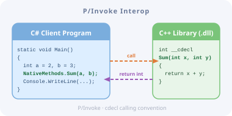

# Interop Communication Example

## The motivation, purpose, and ideas

Sometimes, when I work on hardware-related projects, I see that some tasks are better to implement in C++ than in C#. The reasons are performance-related, compatibility-related, and also culturally related. On the other hand, some functionality, such as web services or database communications, is more efficient to implement in C#. And I got curious: how easy or difficult is it to integrate the benefits of both technologies into a single solution? And, is it possible to debug the control flow transparently through the border between them, as if it were one homogeneous piece of code?

This project is the result of my series of experiments in this direction. Also, it can serve as a boilerplate for developing a native C++ DLL and a C# client EXE in a single Visual Studio solution.

**The scope of the experiment is modeling two projects, working together:**

- a very abstract device driver (NativeDeviceLib.dll)
- a simple console client application (ManagedClient.exe)

## The documentation on the project

### [Concept](Doc/00-Concept.md)

The [article](Doc/00-Concept.md) describes technical requirements and restrictions of the project, including:

- Application Binary Interface
- Exceptions processing policy
- Function wrapping at the managed side

### Toolchain & Environment Preparation

The development was performed in Microsoft Visual Studio 2026.

**Visual Studio** should contain the following tools:

- Desktop development with C++
- .NET desktop development

That's it. The solution was developed and tested on macOS running on a Silicon M3 processor under Parallels virtualization environment with Windows 11 Pro. Most likely, the target machine can vary across project configurations, depending on users' hardware.

### [Stage 1. Simplest implementation](Doc/01-Stage-01.md)

At [Stage 1](Doc/01-Stage-01.md), the initial solution creation process is described. The solution contains two projects:

- The simplest C++ library with one function that accepts two parameters and returns the sum of them to the client.
- The simplest C# console app which connects to the library, calls the function, and prints the result to the console.

### [Stage 2. Simulated Device Driver](Doc/02-Stage-02.md)

At [Stage 2](Doc/02-Stage-02.md), we emulate real (imaginary) device driver behavior:

- The C++ library exposes two functions to emulate some "measurement" process with different durations.
- The C# client calls these two functions in different tasks to have them working simultaneously, waits until both of them return those results, and prints the  results to the console.

### External Document References

- Microsoft: [Extern (C++)](https://learn.microsoft.com/en-us/cpp/cpp/extern-cpp?view=msvc-180)
- Microsoft: [Platform Invoke (P/Invoke)](https://learn.microsoft.com/en-us/dotnet/standard/native-interop/pinvoke)
